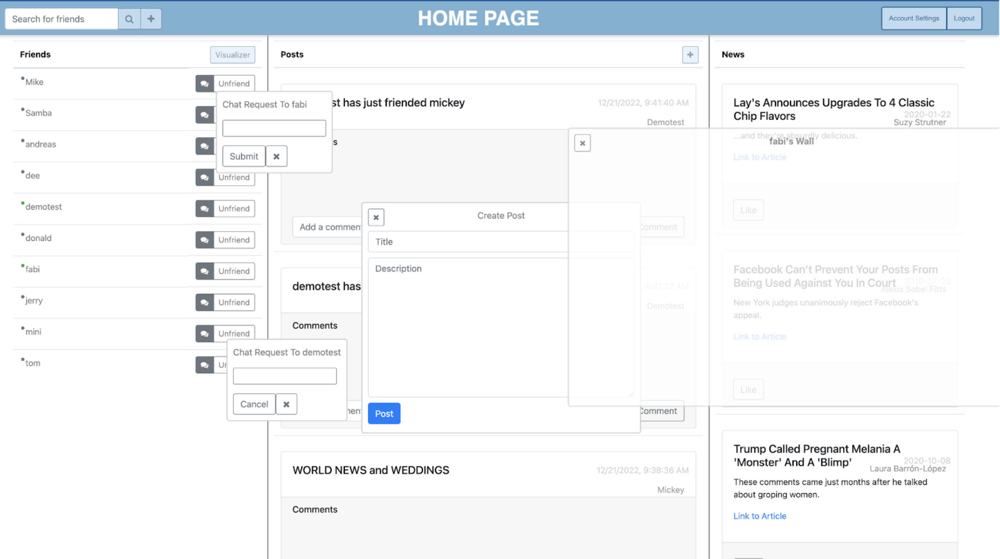
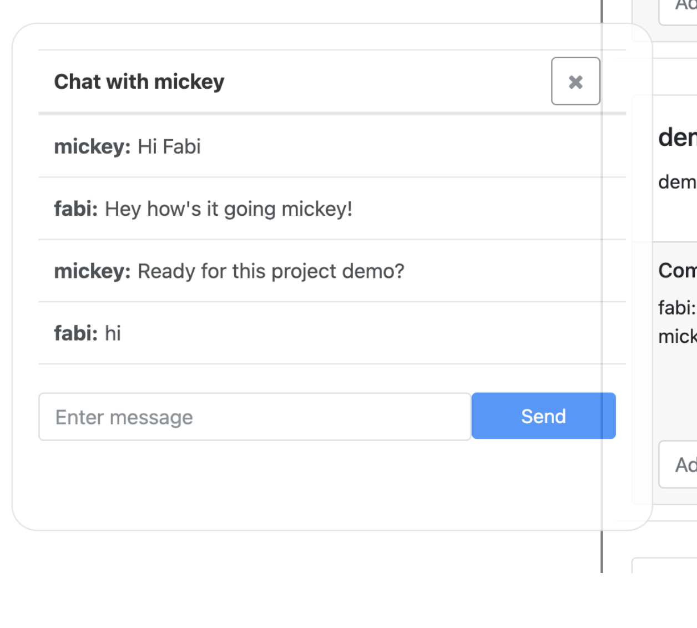
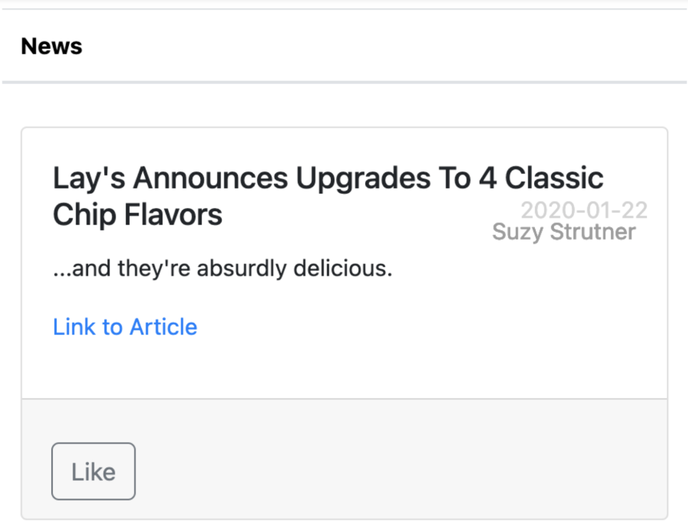

# Pennbook

Pennbook is a social networking platform with the following features:

## Home Page

A home page that's divided into your friends, status posts, and news. The home page also features a search bar, which allows you search through the database of users to add new friends or stalk their posts. 

## Chat

Messaging capabilities between friends. Chat's are persistent, and show a history of messages between user-to-user. 

## Friends

Ability to add friends, see who's online, unfriend, and a visualizer to see a network of friends

## Posts

Ability to create status updates and see new friendships and account updates

## News

On the homepage, we display a list of articles from the article database

## Account Settings

Ability to change affiliation, interests, email, and password
## Signup

Ability to create new accounts within the system
## Live Refresh

Auto refreshes indicators, posts, and other elements on the page
## Dragging

Use of modals to allow for dragging windows
## Instructions for Building and Running the Project

1. Clone the repository to your local machine
2. Run npm install to install all necessary dependencies
3. Set up the database by adding the necessary schemas
4. Run the project using npm start
5. Note: Make sure you have Node.js and npm installed on your machine.

We hope you enjoy using Pennbook!

